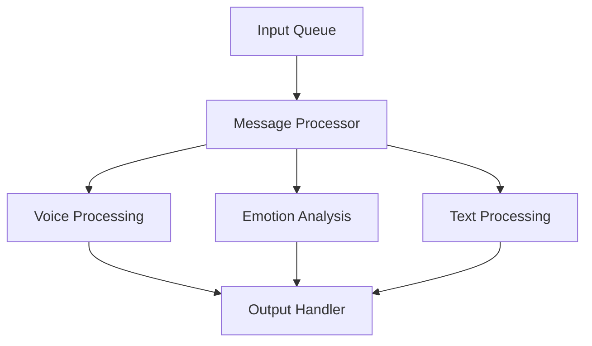

# **Journaly - ML-Based Feedback Analysis System**

---

## **System Overview**

Journaly is a mobile application designed for secure journaling and feedback analysis. The system focuses on user data privacy while providing comprehensive journaling and analytics features. It consists of:

1. **Frontend**: A Flutter-based mobile application.
2. **Backend**: Supports security, storage, and AI services.

---

## **Core Components**

### 1. **Mobile Application**
The frontend is built using Flutter and serves as the user-facing interface.

### 2. **API Endpoints**
- **Authentication System**
  - User creation/login
  - Session handling
  - User management (deletion/deactivation)
- **User Profile Management**
  - Manage user preferences and profile data.
- **Journaling System**
  - Record and store voice and text-based journal entries.
- **Analytics Engine**
  - Provide detailed insights into user entries.

### 3. **ML Pipeline**
The ML system processes user journal entries using a sequence of models to ensure comprehensive and reliable analysis.

---

## **ML System Architecture**

The architecture consists of several components designed to analyze journal entries using machine learning models.

### **Models Used**
1. **Voice to Text (Transcription)**: Converts voice input into text.
2. **Voice to Emotion**: Detects emotions from voice recordings.
3. **Text Sentence Correction**: Corrects grammar and spelling in text entries.
4. **Text to Emotion**: Identifies emotions in written text.
5. **Named Entity Recognition (NER)**: Extracts key entities from text.
6. **Binary Sentiment Classification**: Classifies text as positive or negative.
7. **Rating Prediction**: Predicts ratings based on journal entries.

---

## **ML Pipeline Setup**

### **Prerequisites**
1. **AWS S3 Setup**
   - Uses **MountPoint** for accessing S3 as a local filesystem.
   - Refer to the [MountPoint S3 Documentation](https://github.com/aws/mountpoint-s3) for installation and configuration.
2. **Whisper Transcription**
   - Setup based on `whisper.cpp`.
   - Download the pre-compiled executable (~1.5 MB).
   - Ensure required libraries are installed: `libstdc++` and `libgomp1`.
3. **Hugging Face Setup**
   - Ensure required models are configured and available locally.

---

### **Running the ML Pipeline**

1. **Mount Folders**
   - Use MountPoint to link appropriate AWS S3 folders locally for input/output data.

2. **Start the SQS Consumer**
   - Run the SQS consumer service to process incoming journal entries.

3. **Testing and Debugging**
   - For debugging, run individual pipeline components to ensure correctness.

---

## **System Requirements**

- **Memory Requirements**
  - **RAM**: ~3GB RSS memory
  - **Virtual Memory**: ~11GB
- **Environment Recommendations**
  - Use an isolated machine for running the pipeline (preferred over Docker).

---

## **Output Format**

The system outputs analysis results in JSON format, with the following structure:

```json
{
  "transcription": "Transcribed text from voice input.",
  "emotion_analysis": {
    "voice_emotion": "Emotion from voice",
    "text_emotion": "Emotion from text"
  },
  "corrected_text": "Corrected text entry",
  "named_entities": [
    {"entity": "Name", "type": "Person"},
    {"entity": "Place", "type": "Location"}
  ],
  "sentiment": "Positive/Negative",
  "rating": 4.5
}
```

---

## **Development Notes**

- **Dependencies**
  - All dependencies are localized to the project directory.
  - Whisper model downloads are automated.
- **File Structure**
  - Uses relative paths for easier portability.
- **Message Queue**
  - AWS SQS is used for processing voice journal entries asynchronously.
- **Features**
  - Automatic model loading and file watching capabilities.

---

## **TODOs**

1. **Model Loading**
   - Verify functionality in the `file_watcher` component.
2. **Integration Tasks**
   - Complete integration with Cowj.
3. **Documentation**
   - Expand detailed descriptions for each model.
   - Add sections for enterprise-specific features.

---

# 🤖 ML-Serving Pipeline

[](https://www.python.org/downloads/)
[](https://opensource.org/licenses/MIT)
[](https://github.com/psf/black)

> 🚀 High-performance ML model serving infrastructure for voice processing, emotion analysis, and text processing

## 🌟 Features

- 🎯 **Efficient Model Serving**: Optimized for production environments
- 🔊 **Voice Processing**: State-of-the-art voice-to-text conversion using Whisper
- 💭 **Emotion Analysis**: Real-time emotion detection from voice and text
- 📊 **Pipeline Management**: Robust message queue-based processing
- 📈 **Performance Monitoring**: Built-in logging and performance tracking

## 🏗️ Architecture



## 🚀 Quick Start

### Prerequisites

```bash
# Clone the repository
git clone https://github.com/yourusername/ml-serving.git
cd ml-serving

# Create virtual environment
python -m venv venv
source venv/bin/activate  # On Windows: .\venv\Scripts\activate

# Install dependencies
pip install -r requirements.txt
```

### Running the Pipeline

```bash
# Start the message processor
python src/pipeline/processor/message_processor.py

# Process a single file
./scripts/voice2text/voice-2-text.sh input.wav output/
```

## 📦 Model Management

### Voice Processing
- Uses Whisper for accurate voice-to-text conversion
- Supports multiple audio formats
- Configurable processing parameters

### Emotion Analysis
- Real-time emotion detection
- Support for both voice and text inputs
- Configurable confidence thresholds

### Text Processing
- Text normalization
- Entity extraction
- Sentiment analysis

## ⚙️ Configuration

```yaml
# config/model_config/voice_model.yaml
model:
  name: whisper-large-v2
  parameters:
    beam_size: 5
    temperature: 0.0
```

## 🔧 Development

```bash
# Run tests
pytest tests/

# Format code
black .

# Run linting
flake8
```

## 📊 Performance

| Model | Latency (p95) | Throughput |
|-------|---------------|------------|
| Voice | 250ms        | 100 req/s  |
| Emotion| 50ms         | 500 req/s  |
| Text  | 30ms         | 800 req/s  |

## 📝 License

This project is MIT licensed. See [LICENSE](LICENSE) for details.

## 🤝 Contributing

1. Fork the repository
2. Create your feature branch (`git checkout -b feature/amazing-feature`)
3. Commit your changes (`git commit -m 'Add amazing feature'`)
4. Push to the branch (`git push origin feature/amazing-feature`)
5. Open a Pull Request

## 📫 Contact

Project Link: [https://github.com/yourusername/ml-serving](https://github.com/yourusername/ml-serving)

---
⭐️ Star us on GitHub — it motivates us a lot!