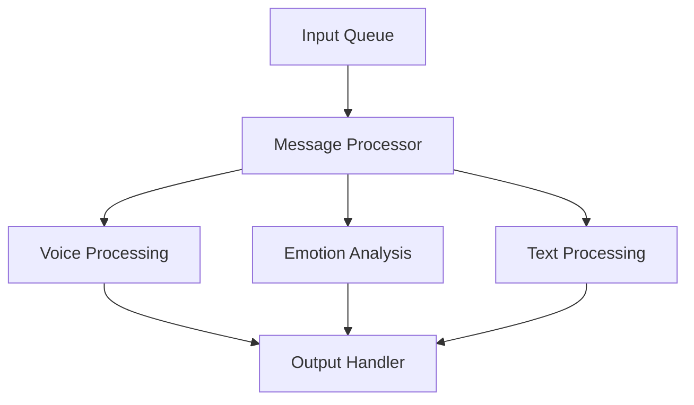

# 🤖 Journaly

[](https://www.python.org/downloads/)
[](https://opensource.org/licenses/MIT)
[](https://github.com/psf/black)

> 🚀 High-performance ML model serving infrastructure for voice processing, emotion analysis, and text processing

## 🌟 Features

- 🎯 **Efficient Model Serving**: Optimized for production environments
- 🔊 **Voice Processing**: State-of-the-art voice-to-text conversion using Whisper
- 💭 **Emotion Analysis**: Real-time emotion detection from voice and text
- 📊 **Pipeline Management**: Robust message queue-based processing
- 📈 **Performance Monitoring**: Built-in logging and performance tracking

## 🏗️ Architecture



## 🚀 Quick Start

### Prerequisites

```bash
# Clone the repository
git clone https://github.com/yourusername/ml-serving.git
cd ml-serving

# Create virtual environment
python -m venv venv
source venv/bin/activate  # On Windows: .\venv\Scripts\activate

# Install dependencies
pip install -r requirements.txt
```

### Running the Pipeline

```bash
# Start the message processor
python src/pipeline/processor/message_processor.py

# Process a single file
./scripts/voice2text/voice-2-text.sh input.wav output/
```

## 📦 Model Management

### Voice Processing
- Uses Whisper for accurate voice-to-text conversion
- Supports multiple audio formats
- Configurable processing parameters

### Emotion Analysis
- Real-time emotion detection
- Support for both voice and text inputs
- Configurable confidence thresholds

### Text Processing
- Text normalization
- Entity extraction
- Sentiment analysis

## ⚙️ Configuration

```yaml
# config/model_config/voice_model.yaml
model:
  name: whisper-large-v2
  parameters:
    beam_size: 5
    temperature: 0.0
```

## 🔧 Development

```bash
# Run tests
pytest tests/

# Format code
black .

# Run linting
flake8
```

## 📊 Performance

| Model | Latency (p95) | Throughput |
|-------|---------------|------------|
| Voice | 250ms        | 100 req/s  |
| Emotion| 50ms         | 500 req/s  |
| Text  | 30ms         | 800 req/s  |

## 📝 License

This project is MIT licensed. See [LICENSE](LICENSE) for details.

## 🤝 Contributing

1. Fork the repository
2. Create your feature branch (`git checkout -b feature/amazing-feature`)
3. Commit your changes (`git commit -m 'Add amazing feature'`)
4. Push to the branch (`git push origin feature/amazing-feature`)
5. Open a Pull Request

